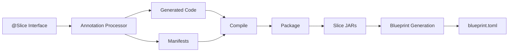
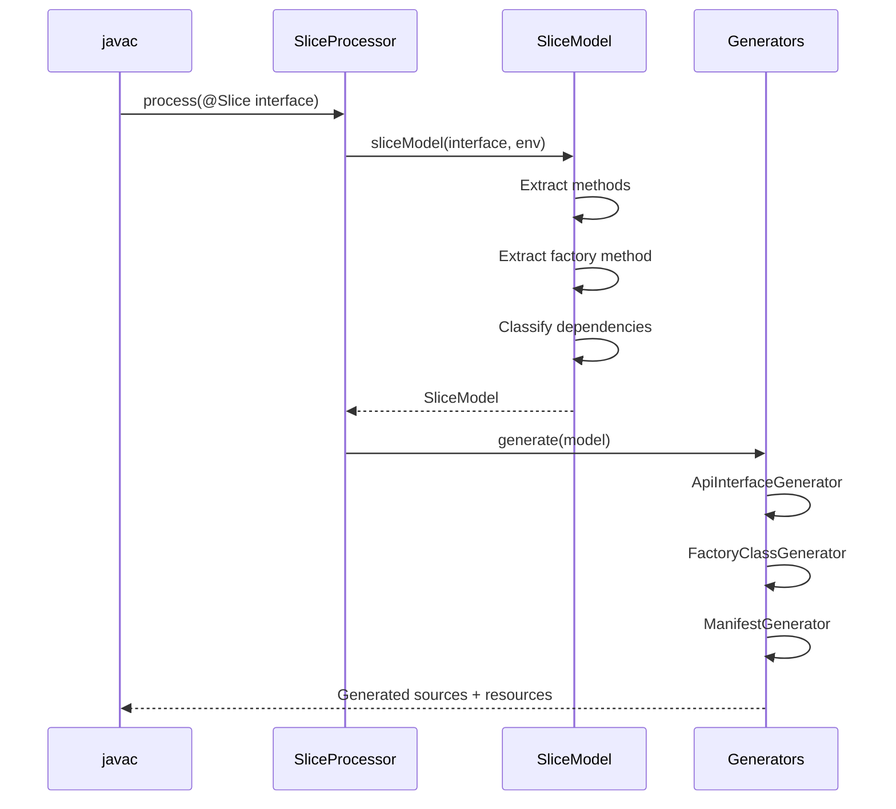
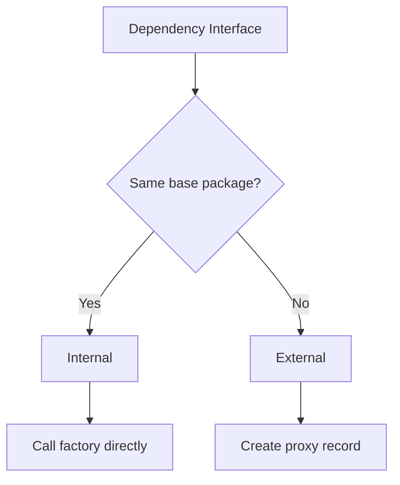
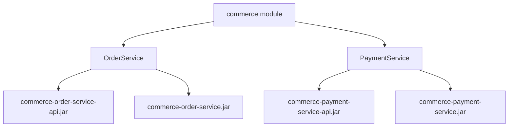

# Slice Architecture

This document explains how Aether slices are built, from source code to deployable artifacts.

## What is a Slice?

A **slice** is a self-contained business capability that:
- Exposes a single-responsibility API via a Java interface
- Receives requests and returns responses asynchronously (`Promise<T>`)
- Declares its dependencies explicitly via a factory method
- Can be deployed, scaled, and updated independently

```java
@Slice
public interface OrderService {
    Promise<OrderResult> placeOrder(PlaceOrderRequest request);

    static OrderService orderService(InventoryService inventory,
                                     PricingEngine pricing) {
        return new OrderServiceImpl(inventory, pricing);
    }
}
```

## Build Pipeline Overview



## Annotation Processing Phase

When `javac` compiles a class annotated with `@Slice`, the `SliceProcessor` intercepts it and generates:

| Generated Artifact | Location | Purpose |
|-------------------|----------|---------|
| API Interface | `{package}.api.{SliceName}` | Public contract for consumers |
| Factory Class | `{package}.{SliceName}Factory` | Creates slice instances with wiring |
| Slice Manifest | `META-INF/slice/{SliceName}.manifest` | Metadata for packaging/deployment |
| API Manifest | `META-INF/slice-api.properties` | Maps artifact to API interface |

### Processing Flow



### SliceModel Extraction

The `SliceModel` extracts from the `@Slice` interface:

```java
public record SliceModel(
    String packageName,        // e.g., "org.example.order"
    String simpleName,         // e.g., "OrderService"
    String qualifiedName,      // e.g., "org.example.order.OrderService"
    String apiPackage,         // e.g., "org.example.order.api"
    String factoryMethodName,  // e.g., "orderService"
    List<MethodModel> methods,
    List<DependencyModel> dependencies
) {}
```

**Method extraction rules:**
- Must return `Promise<T>` where `T` is the response type
- Must have exactly one parameter (the request type)
- Static methods and default methods are ignored

**Factory method detection:**
- Static method returning the interface type
- Parameters become dependencies
- Name becomes `factoryMethodName`

## Dependency Classification

Dependencies are classified as **internal** or **external** based on package:



**Internal dependency** (same module):
- Package starts with slice's base package
- Factory calls the dependency's factory method directly
- Example: `org.example.order.validation.Validator` is internal to `org.example.order.OrderService`

**External dependency** (different module):
- Package doesn't match slice's base package
- Generates a local proxy record that delegates to `SliceInvokerFacade`
- Example: `org.example.inventory.InventoryService` is external to `org.example.order.OrderService`

## Generated Code Deep Dive

### API Interface Generation

The API interface is a copy of the `@Slice` interface in the `.api` subpackage, minus the factory method:

**Input:**
```java
package org.example.order;

@Slice
public interface OrderService {
    Promise<OrderResult> placeOrder(PlaceOrderRequest request);
    static OrderService orderService(InventoryService inv) { ... }
}
```

**Output:**
```java
package org.example.order.api;

public interface OrderService {
    Promise<OrderResult> placeOrder(PlaceOrderRequest request);
}
```

**Design decision:** The API interface exists so consumers can depend only on the contract, not the implementation module.

### Factory Class Generation

The factory provides two entry points:

```java
public final class OrderServiceFactory {
    private OrderServiceFactory() {}

    // Returns typed slice instance
    public static Promise<OrderService> create(
            Aspect<OrderService> aspect,
            SliceInvokerFacade invoker) {
        // Internal deps: call factory directly
        var validator = OrderValidator.orderValidator();

        // External deps: create proxy record
        record inventoryService(SliceInvokerFacade invoker)
                implements InventoryService {
            private static final String ARTIFACT = "org.example:inventory:1.0.0";

            @Override
            public Promise<Integer> checkStock(String productId) {
                return invoker.invoke(ARTIFACT, "checkStock",
                                      productId, Integer.class);
            }
        }
        var inventory = new inventoryService(invoker);

        // Call developer's factory
        var instance = OrderService.orderService(validator, inventory);
        return Promise.successful(aspect.apply(instance));
    }

    // Returns Slice for Aether runtime
    public static Promise<Slice> createSlice(
            Aspect<OrderService> aspect,
            SliceInvokerFacade invoker) {
        record orderServiceSlice(OrderService delegate) implements Slice {
            @Override
            public List<SliceMethod<?, ?>> methods() {
                return List.of(
                    new SliceMethod<>(
                        MethodName.methodName("placeOrder").unwrap(),
                        delegate::placeOrder,
                        new TypeToken<OrderResult>() {},
                        new TypeToken<PlaceOrderRequest>() {}
                    )
                );
            }
        }

        return create(aspect, invoker)
                   .map(orderServiceSlice::new);
    }
}
```

**Key design decisions:**

1. **Local proxy records**: External dependency proxies are generated as local records inside the `create()` method, not as separate classes. This keeps the implementation encapsulated.

2. **Aspect support**: The `Aspect<T>` parameter allows runtime decoration (logging, metrics, etc.) without modifying slice code.

3. **SliceInvokerFacade**: Proxies delegate to this interface, which the Aether runtime implements to route calls across the cluster.

4. **TypeToken usage**: Preserves generic type information for serialization/deserialization at runtime.

### Proxy Method Generation

Proxy methods always have exactly one parameter (slice contract requirement):

```java
@Override
public Promise<Integer> checkStock(String productId) {
    return invoker.invoke(ARTIFACT, "checkStock", productId, Integer.class);
}
```

The `invoke` call includes:
- **ARTIFACT**: Maven coordinates of the target slice
- **Method name**: String identifier for routing
- **Request**: The single parameter value
- **Response type**: For deserialization

## Manifest Generation

### Slice Manifest (`META-INF/slice/{SliceName}.manifest`)

Properties file containing all metadata needed for packaging and deployment:

```properties
# Identification
slice.name=OrderService
slice.artifactSuffix=order-service
slice.package=org.example.order

# Classes for API JAR
api.classes=org.example.order.api.OrderService

# Classes for Impl JAR
impl.classes=org.example.order.OrderService,\
             org.example.order.OrderServiceFactory,\
             org.example.order.OrderServiceFactory$orderServiceSlice,\
             org.example.order.OrderServiceFactory$inventoryService

# Request/Response types (for Impl JAR)
request.classes=org.example.order.PlaceOrderRequest
response.classes=org.example.order.OrderResult

# Artifact coordinates
base.artifact=org.example:commerce
api.artifactId=commerce-order-service-api
impl.artifactId=commerce-order-service

# Dependencies for blueprint generation
dependencies.count=2
dependency.0.interface=org.example.order.validation.OrderValidator
dependency.0.external=false
dependency.0.artifact=
dependency.0.version=
dependency.1.interface=org.example.inventory.InventoryService
dependency.1.external=true
dependency.1.artifact=org.example:inventory
dependency.1.version=1.0.0

# Metadata
generated.timestamp=2024-01-15T10:30:00Z
processor.version=0.4.8
```

### API Manifest (`META-INF/slice-api.properties`)

Maps artifact coordinates to the API interface:

```properties
api.artifact=org.example:commerce:api
slice.artifact=org.example:commerce
api.interface=org.example.order.api.OrderService
impl.interface=org.example.order.OrderService
```

## Multi-Artifact Packaging

A single source module with multiple `@Slice` interfaces produces separate Maven artifacts:



### Maven Plugin Goals

| Goal | Phase | Description |
|------|-------|-------------|
| `jbct:package-slices` | package | Creates separate JARs from manifests |
| `jbct:install-slices` | install | Installs with distinct artifactIds |
| `jbct:deploy-slices` | deploy | Deploys to remote repository |

### JAR Contents

**API JAR** (`commerce-order-service-api-1.0.0.jar`):
```
org/example/order/api/OrderService.class
META-INF/MANIFEST.MF
```

**Impl JAR** (`commerce-order-service-1.0.0.jar`):
```
org/example/order/OrderService.class
org/example/order/OrderServiceImpl.class
org/example/order/OrderServiceFactory.class
org/example/order/OrderServiceFactory$orderServiceSlice.class
org/example/order/OrderServiceFactory$inventoryService.class
org/example/order/PlaceOrderRequest.class
org/example/order/OrderResult.class
META-INF/slice/OrderService.manifest
META-INF/MANIFEST.MF
```

## Blueprint Generation

The `jbct:generate-blueprint` goal creates a deployment descriptor:


### Dependency Resolution

1. **Local slices**: Read from `target/classes/META-INF/slice/*.manifest`
2. **External dependencies**: Read from dependency JARs in Maven classpath
3. **Internal inter-slice**: Match interface names to other local manifests

### Topological Ordering

Dependencies are listed before dependents:

```toml
# Generated by jbct:generate-blueprint
id = "org.example:commerce:1.0.0"

[[slices]]
artifact = "org.example:inventory-service:1.0.0"
instances = 1
# transitive dependency

[[slices]]
artifact = "org.example:commerce-payment-service:1.0.0"
instances = 1

[[slices]]
artifact = "org.example:commerce-order-service:1.0.0"
instances = 1
```

## Version Resolution

External dependency versions are resolved from `slice-deps.properties`:

```properties
# Generated by jbct:collect-slice-deps
org.example\:inventory\:api=1.0.0
org.example\:pricing\:api=2.1.0
```

This file is created by the `jbct:collect-slice-deps` goal, which scans Maven dependencies with `scope=provided` and `classifier=api`.

## Extension Points

### Custom Aspects

Implement `Aspect<T>` to decorate slice instances:

```java
public class LoggingAspect<T> implements Aspect<T> {
    @Override
    public T apply(T instance) {
        // Return proxy that logs method calls
        return createLoggingProxy(instance);
    }
}
```

### SliceInvokerFacade

The runtime implements this to route inter-slice calls:

```java
public interface SliceInvokerFacade {
    <R> Promise<R> invoke(String sliceArtifact,
                          String methodName,
                          Object request,
                          Class<R> responseType);
}
```

## Design Trade-offs

| Decision | Trade-off | Rationale |
|----------|-----------|-----------|
| Single-param methods | Less flexible API | Enables uniform request/response serialization |
| Local proxy records | Larger generated code | Keeps proxies encapsulated, no class pollution |
| Separate API/Impl JARs | More artifacts to manage | Clean dependency boundaries |
| Properties-based manifests | Less structured than JSON/YAML | Simple to parse, no dependencies |
| Compile-time wiring | No runtime discovery | Fail-fast, explicit dependencies |
