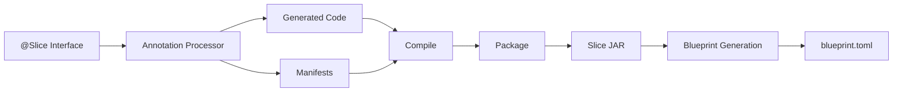
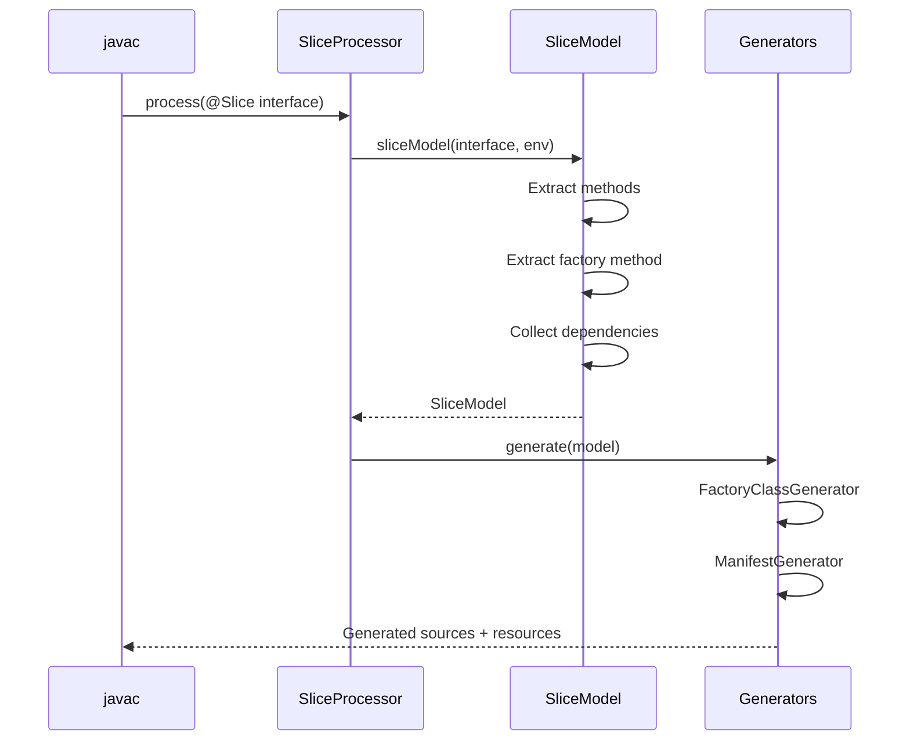
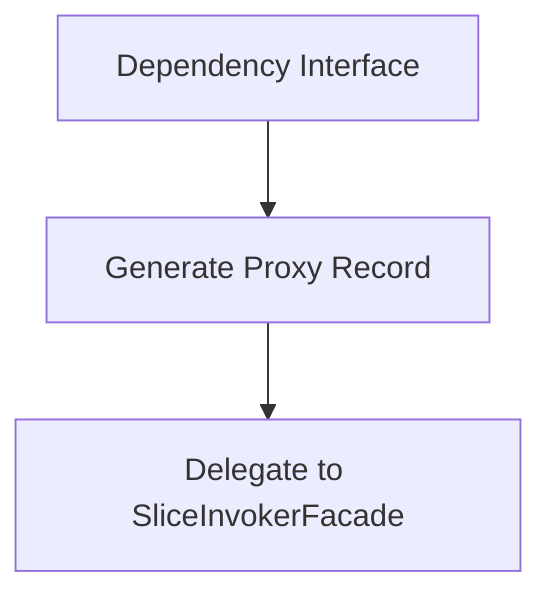
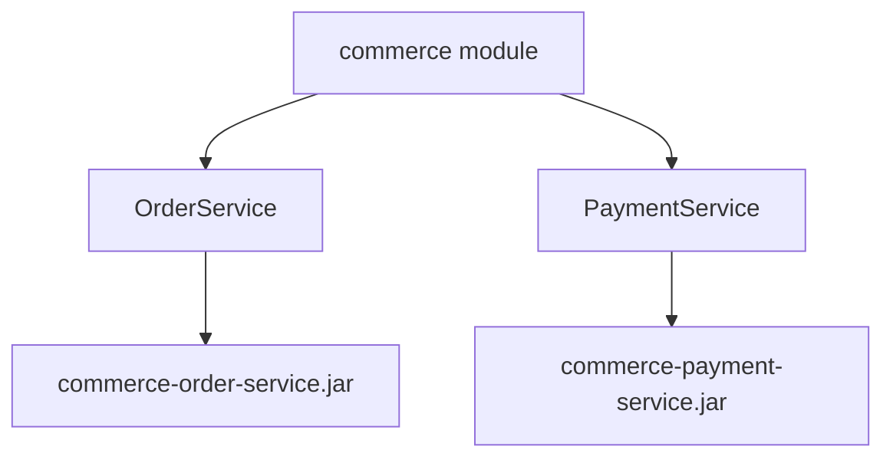

# Slice Architecture

This document explains how Aether slices are built, from source code to deployable artifacts.

## What is a Slice?

A **slice** is a self-contained business capability that:
- Exposes a single-responsibility API via a Java interface
- Receives requests and returns responses asynchronously (`Promise<T>`)
- Declares its dependencies explicitly via a factory method
- Can be deployed, scaled, and updated independently

```java
@Slice
public interface OrderService {
    Promise<OrderResult> placeOrder(PlaceOrderRequest request);

    static OrderService orderService(InventoryService inventory,
                                     PricingEngine pricing) {
        return new OrderServiceImpl(inventory, pricing);
    }
}
```

## Build Pipeline Overview



## Annotation Processing Phase

When `javac` compiles a class annotated with `@Slice`, the `SliceProcessor` intercepts it and generates:

| Generated Artifact | Location | Purpose |
|-------------------|----------|---------|
| Factory Class | `{package}.{SliceName}Factory` | Creates slice instances with wiring |
| Slice Manifest | `META-INF/slice/{SliceName}.manifest` | Metadata for packaging/deployment |
| Slice API Manifest | `META-INF/slice-api.properties` | Maps artifact to slice interface |

### Processing Flow



### SliceModel Extraction

The `SliceModel` extracts from the `@Slice` interface:

```java
public record SliceModel(
    String packageName,        // e.g., "org.example.order"
    String simpleName,         // e.g., "OrderService"
    String qualifiedName,      // e.g., "org.example.order.OrderService"
    String factoryMethodName,  // e.g., "orderService"
    List<MethodModel> methods,
    List<DependencyModel> dependencies
) {}
```

**Method extraction rules:**
- Must return `Promise<T>` where `T` is the response type
- Must have exactly one parameter (the request type)
- Static methods and default methods are ignored

**Factory method detection:**
- Static method returning the interface type
- Parameters become dependencies
- Name becomes `factoryMethodName`

## Dependency Handling

All dependencies declared in the factory method generate proxy records that delegate to `SliceInvokerFacade`. There is no distinction between "internal" and "external" dependencies - all slice dependencies are resolved at runtime through the invoker.



**Key points:**
- All factory method parameters generate proxies
- Proxies delegate to `SliceInvokerFacade` for remote calls
- Dependencies must use `provided` scope in pom.xml

## Generated Code Deep Dive

### Factory Class Generation

The factory provides two entry points:

```java
public final class OrderServiceFactory {
    private OrderServiceFactory() {}

    // Returns typed slice instance
    public static Promise<OrderService> create(
            Aspect<OrderService> aspect,
            SliceInvokerFacade invoker) {
        // Create proxy records for dependencies
        record inventoryService(SliceInvokerFacade invoker)
                implements InventoryService {
            private static final String ARTIFACT = "org.example:inventory:1.0.0";

            @Override
            public Promise<Integer> checkStock(String productId) {
                return invoker.invoke(ARTIFACT, "checkStock",
                                      productId, Integer.class);
            }
        }
        var inventory = new inventoryService(invoker);

        record pricingEngine(SliceInvokerFacade invoker)
                implements PricingEngine {
            private static final String ARTIFACT = "org.example:pricing:1.0.0";

            @Override
            public Promise<Price> calculate(PriceRequest request) {
                return invoker.invoke(ARTIFACT, "calculate",
                                      request, Price.class);
            }
        }
        var pricing = new pricingEngine(invoker);

        // Call developer's factory
        var instance = OrderService.orderService(inventory, pricing);
        return Promise.successful(aspect.apply(instance));
    }

    // Returns Slice for Aether runtime
    public static Promise<Slice> createSlice(
            Aspect<OrderService> aspect,
            SliceInvokerFacade invoker) {
        record orderServiceSlice(OrderService delegate) implements Slice {
            @Override
            public List<SliceMethod<?, ?>> methods() {
                return List.of(
                    new SliceMethod<>(
                        MethodName.methodName("placeOrder").unwrap(),
                        delegate::placeOrder,
                        new TypeToken<OrderResult>() {},
                        new TypeToken<PlaceOrderRequest>() {}
                    )
                );
            }
        }

        return create(aspect, invoker)
                   .map(orderServiceSlice::new);
    }
}
```

**Key design decisions:**

1. **Local proxy records**: Dependency proxies are generated as local records inside the `create()` method, not as separate classes. This keeps the implementation encapsulated.

2. **Aspect support**: The `Aspect<T>` parameter allows runtime decoration (logging, metrics, etc.) without modifying slice code.

3. **SliceInvokerFacade**: All proxies delegate to this interface, which the Aether runtime implements to route calls across the cluster.

4. **TypeToken usage**: Preserves generic type information for serialization/deserialization at runtime.

### Proxy Method Generation

Proxy methods always have exactly one parameter (slice contract requirement):

```java
@Override
public Promise<Integer> checkStock(String productId) {
    return invoker.invoke(ARTIFACT, "checkStock", productId, Integer.class);
}
```

The `invoke` call includes:
- **ARTIFACT**: Maven coordinates of the target slice
- **Method name**: String identifier for routing
- **Request**: The single parameter value
- **Response type**: For deserialization

## Manifest Generation

### Slice Manifest (`META-INF/slice/{SliceName}.manifest`)

Properties file containing all metadata needed for packaging and deployment:

```properties
# Identification
slice.name=OrderService
slice.artifactSuffix=order-service
slice.package=org.example.order

# Classes for Slice JAR
impl.classes=org.example.order.OrderService,\
             org.example.order.OrderServiceFactory,\
             org.example.order.OrderServiceFactory$orderServiceSlice,\
             org.example.order.OrderServiceFactory$inventoryService,\
             org.example.order.OrderServiceFactory$pricingEngine

# Request/Response types (included in JAR)
request.classes=org.example.order.PlaceOrderRequest
response.classes=org.example.order.OrderResult

# Artifact coordinates
base.artifact=org.example:commerce
impl.artifactId=commerce-order-service

# Dependencies for blueprint generation
dependencies.count=2
dependency.0.interface=org.example.inventory.InventoryService
dependency.0.artifact=org.example:inventory
dependency.0.version=1.0.0
dependency.1.interface=org.example.pricing.PricingEngine
dependency.1.artifact=org.example:pricing
dependency.1.version=2.1.0

# Metadata
generated.timestamp=2024-01-15T10:30:00Z
processor.version=0.6.0
```

### Slice API Manifest (`META-INF/slice-api.properties`)

Maps artifact coordinates to the slice interface:

```properties
slice.artifact=org.example:commerce-order-service
slice.interface=org.example.order.OrderService
```

## Single-Artifact Packaging

Each `@Slice` interface produces a single Maven artifact containing everything needed:



### Maven Plugin Goals

| Goal | Phase | Description |
|------|-------|-------------|
| `jbct:package-slices` | package | Creates slice JAR from manifest |
| `jbct:install-slices` | install | Installs with distinct artifactId |
| `jbct:deploy-slices` | deploy | Deploys to remote repository |

### JAR Contents

**Slice JAR** (`commerce-order-service-1.0.0.jar`) - Fat JAR:
```
org/example/order/OrderService.class
org/example/order/OrderServiceImpl.class
org/example/order/OrderServiceFactory.class
org/example/order/OrderServiceFactory$orderServiceSlice.class
org/example/order/OrderServiceFactory$inventoryService.class
org/example/order/OrderServiceFactory$pricingEngine.class
org/example/order/PlaceOrderRequest.class
org/example/order/OrderResult.class
META-INF/slice/OrderService.manifest
META-INF/slice-api.properties
META-INF/dependencies/org.example.order.OrderServiceFactory  # Runtime deps
META-INF/MANIFEST.MF
  Slice-Artifact: org.example:commerce-order-service:1.0.0
  Slice-Class: org.example.order.OrderServiceFactory
# Plus bundled external dependencies (jackson, etc.)
```

### Dependency File Format

`META-INF/dependencies/{FactoryClass}` declares runtime dependencies:

```
[shared]
# Libraries - JAR only, no instance sharing
org.pragmatica-lite:core:^0.9.0

[infra]
# Infrastructure - JAR + shared instances via InfraStore
org.pragmatica-lite.aether:infra-cache:^0.7.0

[slices]
# Slice dependencies - resolved recursively
org.example:inventory:^1.0.0
org.example:pricing:^2.1.0
```

Version format uses semver ranges (e.g., `^1.0.0` = compatible with 1.x.x).

## Blueprint Generation

The `jbct:generate-blueprint` goal creates a deployment descriptor:


### Dependency Resolution

1. **Local slices**: Read from `target/classes/META-INF/slice/*.manifest`
2. **External dependencies**: Read from dependency JARs in Maven classpath
3. **Inter-slice dependencies**: Match interface names to other manifests

### Topological Ordering

Dependencies are listed before dependents:

```toml
# Generated by jbct:generate-blueprint
id = "org.example:commerce:1.0.0"

[[slices]]
artifact = "org.example:inventory-service:1.0.0"
instances = 1
# transitive dependency

[[slices]]
artifact = "org.example:commerce-payment-service:1.0.0"
instances = 1

[[slices]]
artifact = "org.example:commerce-order-service:1.0.0"
instances = 1
```

## Version Resolution

Dependency versions are resolved from `slice-deps.properties`:

```properties
# Generated by jbct:collect-slice-deps
org.example\:inventory=1.0.0
org.example\:pricing=2.1.0
```

This file is created by the `jbct:collect-slice-deps` goal, which scans Maven dependencies with `scope=provided`.

## Extension Points

### Custom Aspects

Implement `Aspect<T>` to decorate slice instances:

```java
public class LoggingAspect<T> implements Aspect<T> {
    @Override
    public T apply(T instance) {
        // Return proxy that logs method calls
        return createLoggingProxy(instance);
    }
}
```

### SliceInvokerFacade

The runtime implements this to route inter-slice calls:

```java
public interface SliceInvokerFacade {
    <R> Promise<R> invoke(String sliceArtifact,
                          String methodName,
                          Object request,
                          Class<R> responseType);
}
```

## Design Trade-offs

| Decision | Trade-off | Rationale |
|----------|-----------|-----------|
| Single-param methods | Less flexible API | Enables uniform request/response serialization |
| Local proxy records | Larger generated code | Keeps proxies encapsulated, no class pollution |
| Single JAR per slice | Larger artifact | Simplifies deployment, no API/Impl split to manage |
| Properties-based manifests | Less structured than JSON/YAML | Simple to parse, no dependencies |
| Compile-time wiring | No runtime discovery | Fail-fast, explicit dependencies |
| All deps via invoker | Extra indirection | Uniform handling, runtime flexibility |
