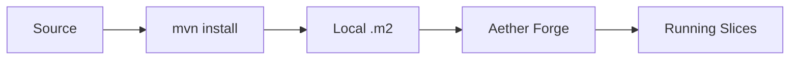
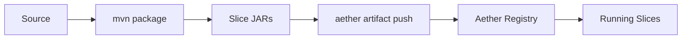

# Slice Deployment

Deploy slices to Aether environments using blueprints and deploy scripts.

## Deployment Architecture

### Local Development (Forge)



Forge reads slices directly from your local Maven repository (`~/.m2/repository`).

### Test/Production Environments



Remote environments use the Aether CLI to push artifacts to the Aether registry.

## Blueprint Generation

### Automatic Generation

```bash
./generate-blueprint.sh
```

Or directly:
```bash
mvn package jbct:generate-blueprint -DskipTests
```

### What Blueprint Contains

```toml
# Generated by jbct:generate-blueprint
# Regenerate with: mvn jbct:generate-blueprint

id = "org.example:commerce:1.0.0"

[[slices]]
artifact = "org.example:inventory-service:1.0.0"
instances = 1
# transitive dependency

[[slices]]
artifact = "org.example:commerce-payment-service:1.0.0"
instances = 2

[[slices]]
artifact = "org.example:commerce-order-service:1.0.0"
instances = 3
```

### Slice Configuration

Blueprint properties are read from per-slice config files at `src/main/resources/slices/{SliceName}.toml`:

```toml
# src/main/resources/slices/OrderService.toml

[blueprint]
instances = 5
```

| Property | Type | Default | Description |
|----------|------|---------|-------------|
| `instances` | int | `3` | Number of slice instances |

If a slice config file is missing, default value is used (`instances = 3`, logged as info message).

### Topological Ordering

The blueprint lists slices in dependency order:
1. External dependencies first (transitive)
2. Local slices ordered by their internal dependencies
3. Dependents after their dependencies

This ensures Aether can start slices in the correct order.

### Custom Blueprint ID

```bash
mvn jbct:generate-blueprint -Djbct.blueprint.id="my-system:prod:2.0.0"
```

### Custom Output Location

```bash
mvn jbct:generate-blueprint -Djbct.blueprint.output=deploy/my-blueprint.toml
```

## Deploy Scripts

Generated by `jbct init --slice`:

| Script | Environment | Mechanism |
|--------|-------------|-----------|
| `deploy-forge.sh` | Local development Forge | `mvn install` → local .m2 |
| `deploy-test.sh` | Test environment | `aether artifact push` |
| `deploy-prod.sh` | Production (with confirmation) | `aether artifact push` |

### deploy-forge.sh

For local development. Installs to local Maven repository, which Forge reads directly:

```bash
#!/bin/bash
# Deploy to local Aether Forge
set -e

echo "Building and installing to local repository..."
mvn clean install -DskipTests

echo ""
echo "Slice installed to local Maven repository."
echo "Forge will automatically detect the update."
echo "Dashboard: http://localhost:8080"
```

### deploy-test.sh

For test environment. Uses Aether CLI to push artifacts:

```bash
#!/bin/bash
# Deploy to test environment
set -e

AETHER_URL="${AETHER_TEST_URL:-http://test.aether.example.com:8080}"

echo "Building..."
mvn clean verify

echo "Pushing artifacts to test..."
aether artifact push target/*.jar --url "$AETHER_URL"
aether blueprint apply target/blueprint.toml --url "$AETHER_URL"

echo ""
echo "Deployed to test: $AETHER_URL"
```

### deploy-prod.sh

For production (with safety confirmation):

```bash
#!/bin/bash
# Deploy to production
set -e

AETHER_URL="${AETHER_PROD_URL:-http://prod.aether.example.com:8080}"

echo "WARNING: Deploying to PRODUCTION"
echo "Target: $AETHER_URL"
echo ""
read -p "Are you sure? (yes/no): " confirm

if [ "$confirm" != "yes" ]; then
    echo "Deployment cancelled"
    exit 1
fi

echo "Building..."
mvn clean verify

echo "Pushing artifacts to production..."
aether artifact push target/*.jar --url "$AETHER_URL"
aether blueprint apply target/blueprint.toml --url "$AETHER_URL"

echo ""
echo "Deployed to production: $AETHER_URL"
```

## Environment Configuration

### Environment Variables

Configure Aether URLs via environment variables:

```bash
# In ~/.bashrc or ~/.zshrc
export AETHER_TEST_URL="http://test.aether.example.com:8080"
export AETHER_PROD_URL="http://prod.aether.example.com:8080"
```

Or set them in CI/CD secrets.

### Aether CLI Configuration

The Aether CLI can also use a configuration file:

```bash
# ~/.aether/config.toml
[environments]
test = "http://test.aether.example.com:8080"
prod = "http://prod.aether.example.com:8080"
```

Then use:
```bash
aether artifact push target/*.jar --env test
```

## Aether Forge

### What is Forge?

Aether Forge is the local development environment for slices:
- Runs slices locally
- Provides hot-reload on code changes
- Simulates cluster behavior
- Includes debugging tools

### Starting Forge

```bash
aether-forge start
```

Default port: 8080

### Forge Dashboard

Access at `http://localhost:8080`:
- View running slices
- Monitor slice health
- View request/response logs
- Inspect dependency graph

### Development Workflow

```bash
# Terminal 1: Start Forge
aether-forge start

# Terminal 2: Build and deploy
./deploy-forge.sh

# Make changes, then redeploy
./deploy-forge.sh
```

Forge watches your local Maven repository and automatically reloads when slices are updated.

## Multi-Module Deployment

For projects with multiple slice modules:

```
parent/
├── pom.xml
├── inventory/
│   └── pom.xml
├── payments/
│   └── pom.xml
└── orders/
    └── pom.xml
```

### Aggregator Blueprint

Create a blueprint that includes all modules:

```bash
# From parent directory
mvn package -DskipTests

# Generate combined blueprint
cat > target/system-blueprint.toml << EOF
id = "org.example:commerce-system:1.0.0"

[[slices]]
artifact = "org.example:inventory-service:1.0.0"
instances = 2

[[slices]]
artifact = "org.example:payment-service:1.0.0"
instances = 1

[[slices]]
artifact = "org.example:order-service:1.0.0"
instances = 3
EOF
```

### Instance Scaling

Modify `instances` in blueprint for different environments:

```toml
# Development
[[slices]]
artifact = "org.example:order-service:1.0.0"
instances = 1

# Production
[[slices]]
artifact = "org.example:order-service:1.0.0"
instances = 5
```

## Dependency Resolution

### How External Dependencies are Resolved

1. **Build time**: Annotation processor records external dependencies in manifest
2. **Blueprint generation**: Reads manifests, recursively resolves transitive deps
3. **Deployment**: Aether Forge/runtime fetches JARs from Maven repository

### Dependency Version Sources

Priority order:
1. Explicit version in `slice-deps.properties`
2. Version from Maven dependency resolution
3. Error if unresolved

### slice-deps.properties

Generated by `jbct:collect-slice-deps`:

```properties
# Escaped colons in property keys
org.example\:inventory-service\:api=1.0.0
org.example\:pricing-engine\:api=2.1.0
```

## Deployment Verification

### Check Deployed Slices

```bash
curl http://localhost:8080/slices
```

Response:
```json
{
  "slices": [
    {
      "artifact": "org.example:order-service:1.0.0",
      "status": "running",
      "instances": 1
    }
  ]
}
```

### Health Check

```bash
curl http://localhost:8080/health
```

### Test Slice Endpoint

```bash
curl -X POST http://localhost:8080/invoke \
  -H "Content-Type: application/json" \
  -d '{
    "slice": "org.example:order-service:1.0.0",
    "method": "placeOrder",
    "request": {"customerId": "CUST-123", "items": []}
  }'
```

## Rollback

### Forge (Development)

```bash
# Redeploy previous version
git checkout v1.0.0
mvn verify && ./deploy-forge.sh
```

### Production

1. Deploy previous version:
```bash
git checkout v1.0.0
mvn verify && ./deploy-prod.sh
```

2. Or use Aether's rollback feature:
```bash
aether rollback org.example:order-service --to v1.0.0
```

## CI/CD Integration

### GitHub Actions Example

```yaml
name: Deploy

on:
  push:
    branches: [main]

jobs:
  deploy-test:
    runs-on: ubuntu-latest
    steps:
      - uses: actions/checkout@v4

      - uses: actions/setup-java@v4
        with:
          java-version: '21'
          distribution: 'temurin'

      - name: Install Aether CLI
        run: |
          curl -sSL https://get.aether.dev | sh
          echo "$HOME/.aether/bin" >> $GITHUB_PATH

      - name: Build and Test
        run: mvn verify

      - name: Deploy to Test
        run: |
          aether artifact push target/*.jar --url "$AETHER_TEST_URL"
          aether blueprint apply target/blueprint.toml --url "$AETHER_TEST_URL"
        env:
          AETHER_TEST_URL: ${{ secrets.AETHER_TEST_URL }}

  deploy-prod:
    needs: deploy-test
    runs-on: ubuntu-latest
    if: github.ref == 'refs/heads/main'
    environment: production
    steps:
      - uses: actions/checkout@v4

      - uses: actions/setup-java@v4
        with:
          java-version: '21'
          distribution: 'temurin'

      - name: Install Aether CLI
        run: |
          curl -sSL https://get.aether.dev | sh
          echo "$HOME/.aether/bin" >> $GITHUB_PATH

      - name: Build
        run: mvn package -DskipTests

      - name: Deploy to Production
        run: |
          aether artifact push target/*.jar --url "$AETHER_PROD_URL"
          aether blueprint apply target/blueprint.toml --url "$AETHER_PROD_URL"
        env:
          AETHER_PROD_URL: ${{ secrets.AETHER_PROD_URL }}
```

### Jenkins Pipeline

```groovy
pipeline {
    agent any

    environment {
        AETHER_TEST_URL = credentials('aether-test-url')
        AETHER_PROD_URL = credentials('aether-prod-url')
    }

    stages {
        stage('Build') {
            steps {
                sh 'mvn verify'
            }
        }

        stage('Deploy Test') {
            steps {
                sh '''
                    aether artifact push target/*.jar --url "$AETHER_TEST_URL"
                    aether blueprint apply target/blueprint.toml --url "$AETHER_TEST_URL"
                '''
            }
        }

        stage('Deploy Prod') {
            when {
                branch 'main'
            }
            input {
                message 'Deploy to production?'
            }
            steps {
                sh '''
                    aether artifact push target/*.jar --url "$AETHER_PROD_URL"
                    aether blueprint apply target/blueprint.toml --url "$AETHER_PROD_URL"
                '''
            }
        }
    }
}
```
