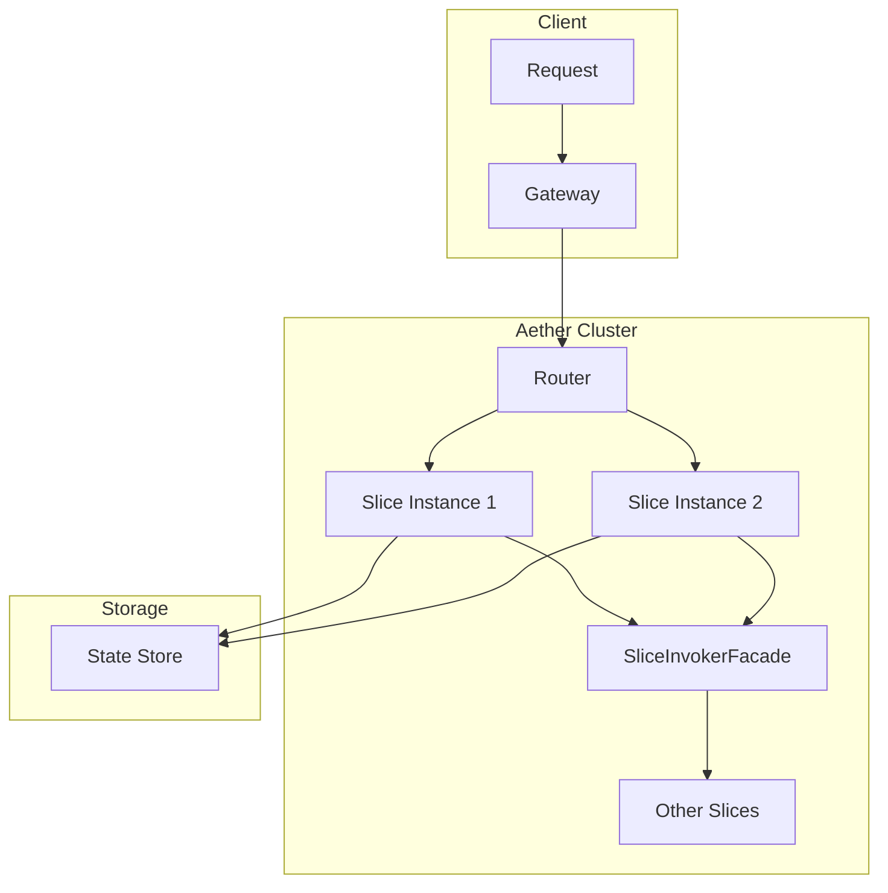
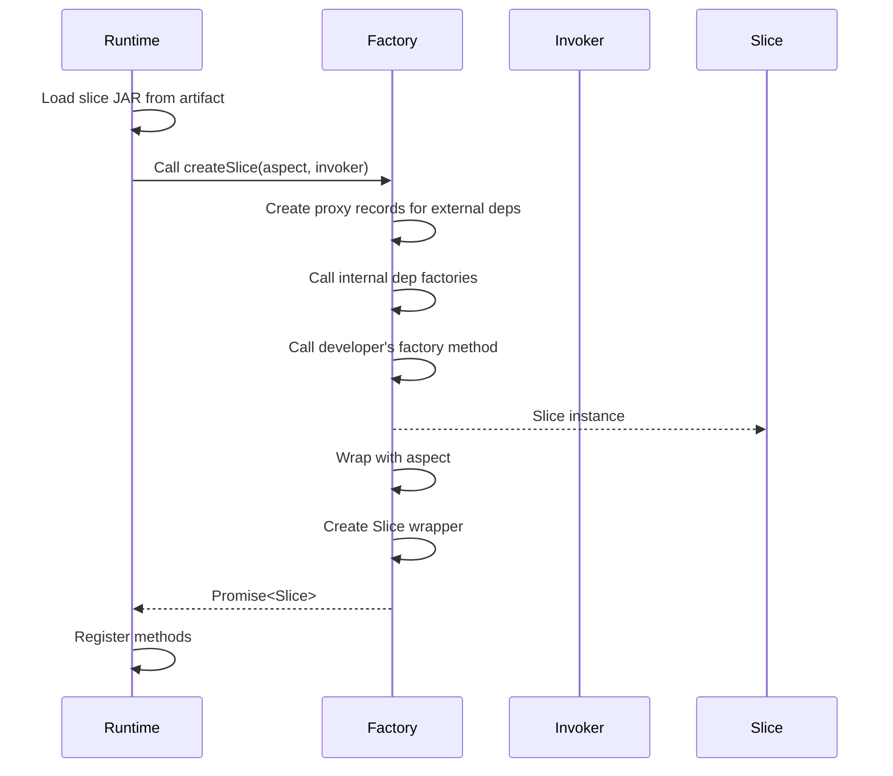
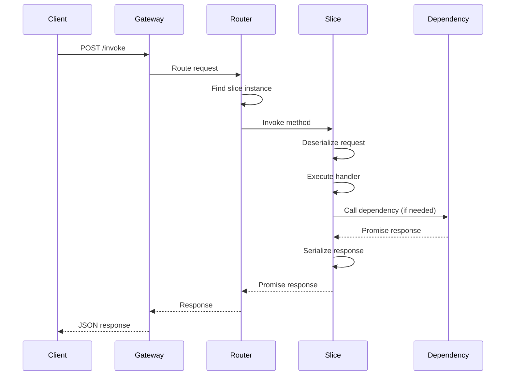
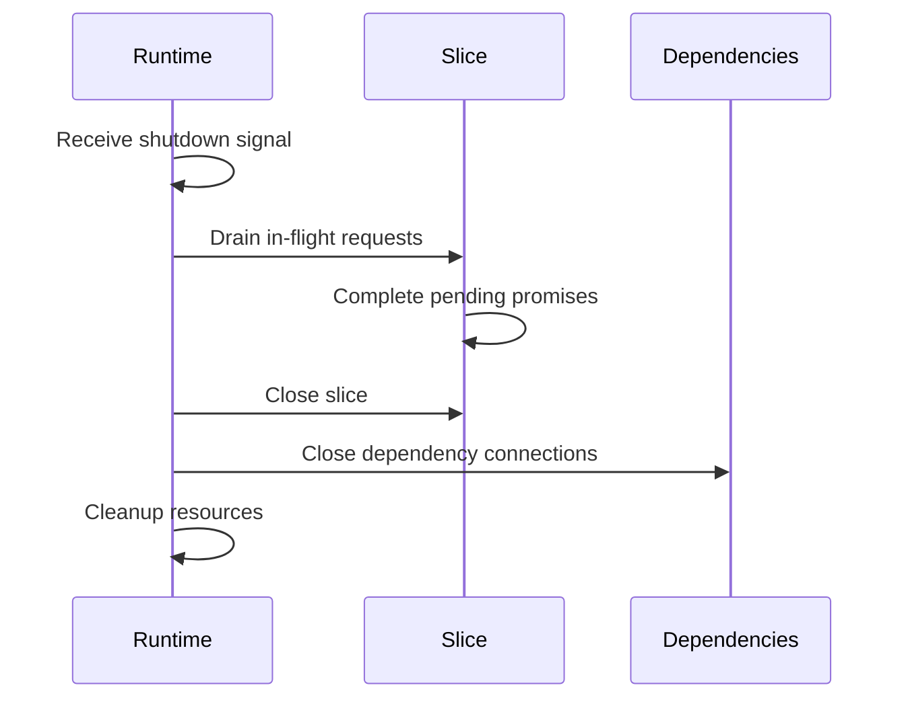
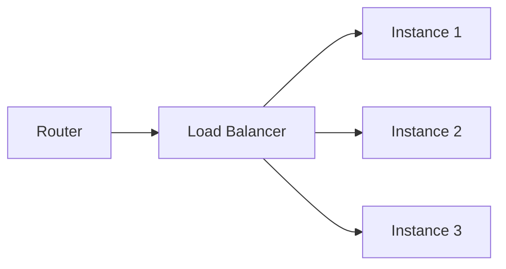
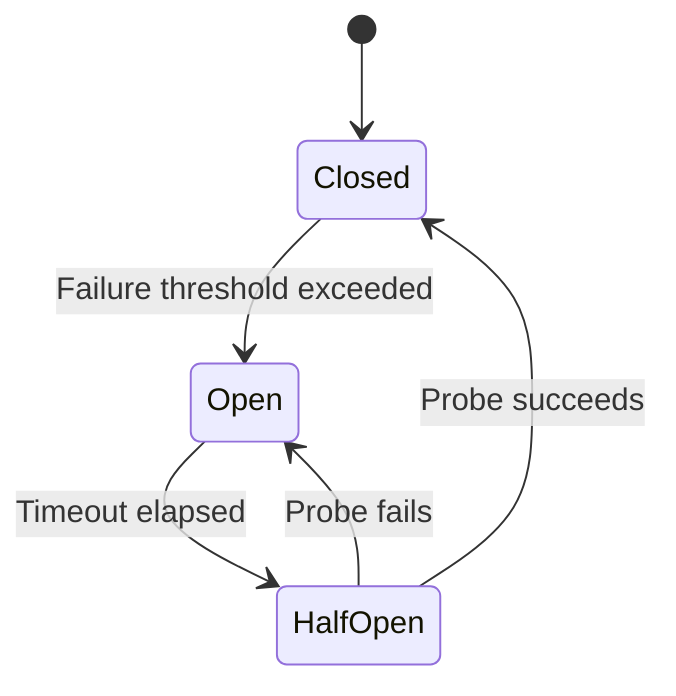

# Slice Runtime

How slices execute in the Aether distributed runtime.

## Runtime Architecture



## ClassLoader Hierarchy

Aether uses a hierarchical ClassLoader model for slice isolation:

```
System/Bootstrap → Node/Application → SharedLibraryClassLoader → SliceClassLoader
                                              ↑                        ↑
                                    [api] + [shared] + [infra]    [slice JAR + conflicts]
```

### Dependency Categories

Declared in `META-INF/dependencies/{FactoryClass}`:

| Section | ClassLoader | Instance Sharing | Use For |
|---------|-------------|------------------|---------|
| `[api]` | Shared | N/A (interfaces) | Slice API interfaces for proxies |
| `[shared]` | Shared | JAR only | Third-party libraries |
| `[infra]` | Shared | JAR + instances | Infrastructure (cache, database) |
| `[slices]` | Per-slice | Full slice | Other slice dependencies |

### Dependency File Example

```
[api]
org.example:inventory-api:^1.0.0
org.example:payment-api:^1.0.0

[shared]
org.pragmatica-lite:core:^0.9.0

[infra]
org.pragmatica-lite.aether:infra-cache:^0.7.0

[slices]
org.example:inventory:^1.0.0
org.example:payment:^1.0.0
```

### Version Format

Semver ranges:
- `^1.0.0` - Compatible with 1.x.x
- `~1.0.0` - Compatible with 1.0.x
- `1.0.0` - Exact version

### InfraStore Pattern

Infrastructure dependencies use shared instances via InfraStore:

```java
// In infra module's factory method
public static CacheService cacheService() {
    return InfraStore.instance()
        .getOrCreate(
            "org.pragmatica-lite.aether:infra-cache",
            Version.version("0.7.0").unwrap(),
            CacheService.class,
            () -> InMemoryCacheService.inMemoryCacheService()
        );
}
```

## Slice Lifecycle

### 1. Loading

When Aether starts a slice:



### 2. Request Handling



### 3. Shutdown



## SliceInvokerFacade

The runtime provides `SliceInvokerFacade` for inter-slice communication:

```java
public interface SliceInvokerFacade {
    <R> Promise<R> invoke(String sliceArtifact,
                          String methodName,
                          Object request,
                          Class<R> responseType);
}
```

### How Invocation Works

1. **Generated proxy calls `invoker.invoke()`**
   ```java
   @Override
   public Promise<Integer> checkStock(StockRequest request) {
       return invoker.invoke(ARTIFACT, "checkStock", request, Integer.class);
   }
   ```

2. **Runtime serializes request** (typically JSON)

3. **Router finds target slice instance**
   - By artifact coordinates
   - With load balancing if multiple instances

4. **Network transport** (internal cluster protocol)

5. **Target slice deserializes and executes**

6. **Response serialized and returned**

### Serialization

Default: JSON via Jackson

Request/response types must be:
- Records or POJOs with getters/setters
- Immutable (no mutable fields)
- Serializable (no transient dependencies)

```java
// Good
public record OrderRequest(String customerId, List<LineItem> items) {}

// Bad - non-serializable field
public record BadRequest(Connection dbConnection) {}
```

## Load Balancing

When multiple instances of a slice exist:



### Strategies

| Strategy | Description | Use Case |
|----------|-------------|----------|
| Round Robin | Rotate through instances | Default, stateless slices |
| Least Connections | Route to least busy | Long-running operations |
| Consistent Hash | Same request → same instance | Caching, local state |
| Random | Random selection | Simple distribution |

### Configuration

In `blueprint.toml`:
```toml
[[slices]]
artifact = "org.example:order-service:1.0.0"
instances = 3
load_balancing = "round_robin"
```

## Error Handling

### Promise Failures

Failed promises propagate through the call chain:

```java
@Override
public Promise<OrderResult> placeOrder(PlaceOrderRequest request) {
    return inventory.reserve(reserveRequest)
                    .flatMap(reserved -> {
                        // This only executes if reserve succeeds
                        return processOrder(reserved);
                    });
    // If reserve() fails, the failure propagates automatically
}
```

### Exception Translation

Exceptions are wrapped for network transport:

```java
// Slice throws
throw new InsufficientStockException("Item out of stock");

// Client receives
Promise.failed(new SliceException(
    "org.example:inventory:1.0.0",
    "reserve",
    "InsufficientStockException: Item out of stock"
));
```

### Timeouts

Default timeout: 30 seconds

Configure per-slice:
```toml
[[slices]]
artifact = "org.example:order-service:1.0.0"
instances = 1
timeout_ms = 60000
```

### Circuit Breaker

Aether includes circuit breaker for failing dependencies:



Configuration:
```toml
[[slices]]
artifact = "org.example:order-service:1.0.0"
circuit_breaker.failure_threshold = 5
circuit_breaker.timeout_ms = 10000
```

## Observability

### Logging

Slice logs include context:

```
2024-01-15 10:30:00.123 INFO [order-service:placeOrder:req-abc123] Processing order
2024-01-15 10:30:00.456 INFO [order-service:placeOrder:req-abc123] Order placed: ORD-789
```

### Metrics

Automatically collected:
- Request count per method
- Latency histogram
- Error rate
- Active requests

Access via Forge dashboard or metrics endpoint:
```bash
curl http://localhost:8080/metrics
```

### Tracing

Distributed tracing across slice calls:

```
Trace: abc123
├── POST /orders (gateway)
│   └── order-service:placeOrder
│       ├── inventory-service:reserve
│       └── payment-service:charge
```

## Resource Management

### Memory

Each slice instance has:
- Heap allocation from JVM
- Off-heap for network buffers

Configure per-slice:
```toml
[[slices]]
artifact = "org.example:order-service:1.0.0"
instances = 1
memory_mb = 512
```

### Thread Pools

Aether uses virtual threads (Project Loom) when available:
- Non-blocking I/O
- Efficient for high concurrency
- No explicit pool sizing needed

Fallback for older JVMs:
```toml
[[slices]]
artifact = "org.example:order-service:1.0.0"
thread_pool_size = 50
```

### Connection Pooling

Inter-slice connections are pooled:
- Reused for multiple requests
- Automatic cleanup of idle connections
- Health checks

## State Management

### Stateless Design

Recommended: Keep slices stateless

```java
// Good - stateless
@Override
public Promise<OrderResult> placeOrder(PlaceOrderRequest request) {
    return stateStore.get(request.customerId())
                     .flatMap(customer -> processOrder(customer, request));
}
```

### External State Store

For persistent state, use external store:

```java
public class OrderServiceImpl implements OrderService {
    private final OrderRepository repository;  // Injected via factory

    @Override
    public Promise<OrderResult> placeOrder(PlaceOrderRequest request) {
        return repository.save(order)
                         .map(saved -> new OrderResult(saved.id()));
    }
}
```

### Instance Affinity

For cache locality, use consistent hashing:

```toml
[[slices]]
artifact = "org.example:order-service:1.0.0"
instances = 3
load_balancing = "consistent_hash"
affinity_key = "customerId"
```

Same `customerId` → same instance → better cache hit rate.

## Scaling

### Manual Scaling

Update blueprint and redeploy:

```toml
[[slices]]
artifact = "org.example:order-service:1.0.0"
instances = 5  # Was 1
```

### Auto-Scaling

Configure scaling rules:

```toml
[[slices]]
artifact = "org.example:order-service:1.0.0"
instances = 1
autoscale.min = 1
autoscale.max = 10
autoscale.metric = "cpu"
autoscale.threshold = 80
```

### Rolling Updates

When deploying new version:

1. New instances start
2. Traffic gradually shifts
3. Old instances drain
4. Old instances terminate

```mermaid
gantt
    title Rolling Update
    dateFormat  X
    section v1.0
    Instance 1    :done, 0, 3
    Instance 2    :done, 0, 4
    section v1.1
    Instance 3    :active, 2, 5
    Instance 4    :active, 3, 5
```



Configure:
```toml
[[slices]]
artifact = "org.example:order-service:1.1.0"
rolling_update.batch_size = 1
rolling_update.delay_ms = 5000
```

## Debugging

### Local Debugging

Attach debugger to Forge:

```bash
aether-forge start --debug-port 5005
```

Then attach IDE debugger to port 5005.

### Remote Debugging

Enable in production (with caution):

```bash
aether-admin enable-debug org.example:order-service:1.0.0 --port 5005
```

### Request Tracing

Trace specific request:

```bash
curl -X POST http://localhost:8080/invoke \
  -H "X-Trace-Id: my-trace-123" \
  -H "X-Debug: true" \
  -d '{"slice": "...", "method": "...", "request": {...}}'
```

View trace:
```bash
curl http://localhost:8080/traces/my-trace-123
```
